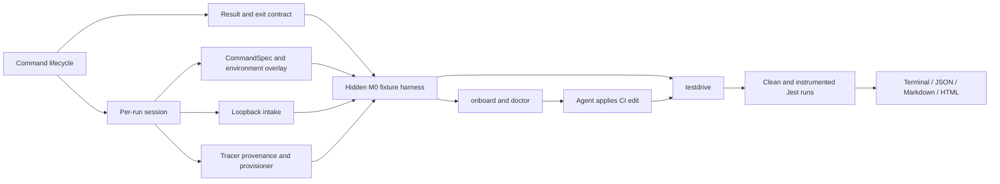

# Agent-driven onboarding: milestones 0 and 1 development plan

Status: proposed

Last updated: 2026-09-09

Related design: [Agent-driven, zero-account onboarding for DDTest](agent-driven-onboarding.md)

## Outcome

Milestone 0 creates the internal contracts needed to run an isolated, credential-free Test Optimization validation safely. It has no promoted customer workflow. Its exit demonstration is a hidden development command that runs a hermetic fixture through an embedded local intake and emits a versioned JSON result without contacting Datadog.

Milestone 1 ships the first customer-visible setup proof for one narrow vertical slice: JavaScript, Jest, and a conventional GitHub Actions test job. It supports the important case where `dd-trace` is installed only by CI auto-instrumentation. An agent can use `onboard`, `doctor`, and `testdrive` to configure the job and prove locally that the selected exact tracer loads, the customer's tests still pass, and Test Optimization events and coverage reach DDTest's local intake.

Milestone 1 is about Test Optimization setup only. It does not estimate savings, replay historical commits, simulate TIA selection, change test distribution, or parallelize tests.

## Fixed product decisions

These decisions are prerequisites for the plan and should not be reopened inside individual implementation PRs:

1. `ddtest onboard` is static. It executes no project code, installs nothing, and performs no network request.
2. A project-local tracer is optional. CI-only auto-instrumentation is a supported setup.
3. Every validation targets one exact tracer version. `latest`, an unbounded major, or a dynamic CI expression is not parity evidence.
4. If the tracer is absent locally, `testdrive` installs the selected exact version under a DDTest-owned isolated prefix after explicit plan approval. It does not edit the customer's package manifest or lockfile.
5. For JavaScript, the instrumented child receives an absolute path to `dd-trace/ci/init`; it does not rely on project package resolution.
6. Project dependencies must already be available. Milestone 1 may provision the Datadog tracer, but it does not run the customer's general dependency installation.
7. Local Test Optimization traffic goes only to DDTest's loopback intake. The JavaScript launch adapter uses certified direct-agentless overrides and a per-run dummy API key unless compatibility testing proves Agent/EVP is required.
8. Setup conclusions remain separate: local tracer compatibility, static CI wiring, tracer/runtime parity, and Datadog delivery.
9. The agent applies repository edits. Milestone 1 emits bounded evidence and exact remediations; it does not introduce a general-purpose autofix or CI rewriting engine.
10. Existing `plan` and `run` behavior remains compatible throughout both milestones.

## Launch support envelope

Milestone 1 reports `INCOMPLETE`, with one concrete next action, outside this envelope:

| Dimension | Supported in milestone 1 |
| --- | --- |
| Language/runtime | Node.js on macOS or Linux; exact supported Node ranges come from the checked-in compatibility matrix |
| Framework | One certified Jest major using a repository-local Jest executable |
| Repository | One workspace at the repository root; normal files or repository-contained symlinks |
| CI provider | GitHub Actions |
| CI shape | One repository-contained workflow and one conventional test job with statically visible setup, dependency-install, instrumentation, and test steps |
| Tracer source | Matching project dependency, exact CI-injected pin, floating CI selector that can be replaced by DDTest's certified pin, or not yet configured |
| Package acquisition | Public npm registry or one explicitly resolved npm registry host; exact `dd-trace` version installed under an isolated prefix |
| Test command | Direct repository-local Jest binary plus allowlisted static arguments; no `npx` download fallback or arbitrary shell wrapper |
| Transport | Credential-free local intake; no real Datadog forwarding |
| Report | Terminal, JSON, Markdown, and self-contained local HTML |

Reusable workflows, composite actions, dynamic matrices, containers, Windows, monorepos, Yarn Plug'n'Play, Bun, Cypress, Playwright, Vitest, Mocha, and non-JavaScript tracers are follow-on work.

## Target command flow

```text
Agent: ddtest onboard --format=json

DDTest:
  framework: javascript/jest
  ci_job: .github/workflows/test.yml:test
  tracer_state: CI_INJECTED_FLOATING
  selected_tracer: dd-trace@<certified-exact-version>
  local_tracer: absent
  remediation: pin the CI installer to the selected version

Agent applies the CI pin and any missing Test Optimization environment.

Agent: ddtest doctor --format=json

DDTest:
  CI_WIRING: PASS (static)
  CI_TRACER_PIN: PASS (static)
  LOCAL_TRACER: NOT_PRESENT (testdrive can provision it)

Agent: ddtest testdrive --print-plan --backend=local

DDTest plan:
  provision dd-trace@<same-exact-version> under <ddtest-cache-prefix>
  registry host: <redacted-safe-host>
  project dependency mutations: none
  start 127.0.0.1:<kernel-assigned-port>
  run one clean representative Jest target
  run the same target with the absolute dd-trace preload
  run the approved Jest suite once with observe-only settings

Agent obtains approval and executes the checksum-bound plan.

DDTest result:
  LOCAL_TRACER_COMPATIBILITY: PASS (observed)
  BASIC_TEST_REPORTING: PASS (observed)
  PER_TEST_COVERAGE: PASS or INCOMPLETE (observed)
  TEST_OUTCOME_PRESERVED: PASS (observed)
  CI_WIRING: PASS (static)
  CI_TRACER_PARITY: PASS (exact version; compatible runtime profile)
  DATADOG_DELIVERY: NOT_RUN
```

## Architecture added by these milestones



The implementation introduces these packages without moving existing planner logic prematurely:

| Package | Responsibility |
| --- | --- |
| `internal/result` | versioned result/check schema, evidence classes, blocker categories, exit-code mapping |
| `internal/session` | unique run IDs, repository-contained artifacts, DDTest cache locations, ownership and cleanup |
| `internal/execution` | immutable `CommandSpec`, explicit environment set/unset, bounded capture, cancellation metadata |
| `internal/testdrive/intake` | owned loopback listener, responses, payload decoding, normalization, drain, protocol diagnostics |
| `internal/testdrive/provision` | tracer provenance, compatibility matrix, provision plans, verified initialization paths |
| `internal/onboarding` | bounded JavaScript/Jest/GitHub Actions discovery and onboarding manifest |
| `internal/doctor` | static setup checks and exact remediations |
| `internal/testdrive` | approved-plan state machine and setup verdicts |
| `internal/runbook` | embedded onboarding runbook and digest |
| `internal/report` | human, JSON, Markdown, and local HTML renderers over `internal/result` |

## Core contracts

### Result and exit semantics

All new commands return a result instead of calling `os.Exit`. The root maps the result to these codes:

| Code | Meaning |
| --- | --- |
| `0` | All requested milestone checks concluded without an actionable setup problem; the test command passed. |
| `1` | A confirmed setup problem or customer test failure; the result distinguishes them. |
| `2` | Validation is incomplete or blocked, while preserving completed checks. |
| `3` | DDTest orchestration or implementation failure. |

The public DTO starts with this minimum shape:

```go
type Result struct {
    SchemaVersion string      `json:"schema_version"`
    DDTestVersion string      `json:"ddtest_version"`
    Command       string      `json:"command"`
    RunID         string      `json:"run_id"`
    Status        Status      `json:"status"`
    Checks        []Check     `json:"checks"`
    Tracer        *Tracer     `json:"tracer,omitempty"`
    CI            *CIEvidence `json:"ci,omitempty"`
    Executions    []Execution `json:"executions,omitempty"`
    Artifacts     []Artifact  `json:"artifacts,omitempty"`
}
```

Checks use stable IDs, `PASS|WARN|FAIL|INCOMPLETE|NOT_RUN`, `static|observed|backend_verified`, one blocker category, evidence with provenance, and at most one first remediation. JSON mode writes only the final DTO to stdout; diagnostics and test output use stderr or declared artifacts.

### Session and artifact layout

Each command resolves the physical repository root once and creates no global mutable singleton paths. The initial layout is:

```text
.testoptimization/
  onboarding/<attempt-id>/manifest.json
  onboarding/<attempt-id>/plan.json
  onboarding/<attempt-id>/approval.json
  testdrive/<run-id>/result.json
  testdrive/<run-id>/report.md
  testdrive/<run-id>/report.html
  testdrive/<run-id>/logs/

<user-cache>/ddtest/tracers/
  javascript/<os>-<arch>-node<major>/dd-trace/<version>/<artifact-key>/
```

DDTest proposes the repository `.gitignore` entry. Run directories use owner-only permissions where supported. The tracer cache key includes the exact top-level tracer version, registry origin, resolved package integrity, Node major, OS, and architecture. The result records the installed dependency-tree digest separately because npm transitive resolution can differ even when the top-level tracer version is exact.

### Command and environment model

New execution paths use a structured command:

```go
type CommandSpec struct {
    Executable string
    Args       []string
    WorkingDir string
    Environment Environment
    Timeout    time.Duration
    Output     OutputPolicy
}

type Environment struct {
    Inherit bool
    Set     map[string]string
    Unset   []string
}
```

Environment construction canonicalizes keys using platform rules, removes an inherited value before setting a replacement, and cannot create duplicate entries. Testdrive scrubs inherited Datadog credentials, destinations, and instrumentation tokens before applying its overlay. Registry credentials are available only to the provision command and are not copied to test commands or result artifacts.

### Tracer provenance

The onboarding manifest stores both observed and selected values:

```text
observed project tracer: package, selector, exact version if provable, file/line
observed CI tracer: installer kind, selector, exact version if provable, file/job/step
selected tracer: package, exact version, compatibility-matrix entry
local strategy: project | ddtest_managed
parity: exact | floating | conflict | unknown
```

Selection order is:

1. reuse a matching exact supported project/CI version;
2. reproduce an exact supported CI pin;
3. replace a floating CI selector with the exact certified default for the detected Node range;
4. for an unconfigured repository, use that same certified default in both the remediation and testdrive;
5. stop on conflicts, unsupported versions, or ambiguous runtime evidence.

### Approval plan

The canonical plan binds:

- DDTest and schema versions;
- repository physical root and relevant evidence-file hashes;
- selected framework, test target, suite command, working directories, and timeouts;
- exact tracer package/version, registry origin, target/cache paths, package lifecycle-script policy, and expected project mutations;
- non-secret environment values plus presence/fingerprints for relevant secrets;
- listener capability, destination mode, dummy credential policy, endpoint families, and output paths;
- cleanup targets and retained artifacts.

Execution rejects a stale digest, changed evidence, changed command target, changed tracer pin, unexpected project mutation, or an approval from another repository. A cache hit does not weaken the binding: the installed artifact and dependency-tree digests are verified before reuse.

## Milestone 0: foundations and hermetic contract

### M0.1 — Command lifecycle and configuration errors

Objective: make new diagnostic commands possible without changing process state from deep helpers.

Implementation:

- Convert `plan` and `run` handlers from `Run` plus `exitProcess` to `RunE` and command results/errors returned to `main`.
- Move Git availability checks from the global persistent pre-run into the commands that require Git.
- Replace `settings.Init` exits with an error-returning loader while preserving current flags and environment behavior.
- Make telemetry creation a per-command policy. Milestone 0/1 local commands default to a no-network client.
- Preserve cancellation and current user-visible behavior for `plan` and `run`.

Primary files:

- `main.go`
- `internal/cmd/cmd.go`
- `internal/settings/settings.go`
- `internal/cmd/*_test.go`
- `internal/settings/*_test.go`

Acceptance:

- Invalid configuration returns an error and deterministic exit code without calling `os.Exit` below `main`.
- `onboard`/`doctor` command scaffolds can run when Git is unavailable.
- Existing `plan` and `run` command tests remain green.
- A local command test proves that telemetry opens no socket.

### M0.2 — Result, check, and blocker contract

Objective: establish the public machine contract before implementing checks.

Implementation:

- Add `internal/result` types, schema version `1`, validation, deterministic ordering, and exit mapping.
- Define initial blocker categories: `PROJECT_SETUP_REQUIRED`, `UNSUPPORTED_RUNTIME`, `UNSUPPORTED_FRAMEWORK`, `CI_EVIDENCE_INCOMPLETE`, `TRACER_PROVISIONING_BLOCKED`, `TEST_COMMAND_FAILED`, `TRANSPORT_INCOMPLETE`, and `ORCHESTRATION_ERROR`.
- Add human and JSON renderers sufficient for the hidden harness.
- Add golden JSON fixtures and backward-compatibility tests for schema version `1`.

Acceptance:

- Every non-pass check has evidence and at most one first remediation.
- Independent checks survive another check becoming blocked.
- JSON output is deterministic and contains no log lines.
- Exit-code table is fully covered by tests.

### M0.3 — Per-run sessions and safe command execution

Objective: eliminate shared paths and append-only environment behavior.

Implementation:

- Add `internal/session` with physical-root containment, unique run IDs, private directories, atomic artifact writes, and explicit cleanup.
- Add `internal/execution.CommandSpec` and environment set/unset semantics.
- Adapt `ext.DefaultCommandExecutor` or wrap it without breaking existing callers.
- Return structured executable, arguments, timing, exit/signal, bounded stdout/stderr locations, and cancellation results.
- Add a protected-file snapshot helper for `package.json` and supported lockfiles.

Acceptance:

- Concurrent sessions cannot reuse one another's files.
- Duplicate environment keys are impossible, including case-insensitive Windows behavior in unit tests.
- Cancellation reaps the process group using the existing platform-specific support.
- Output limits truncate safely while retaining the test exit status.
- Protected-file changes are detected and named precisely.

### M0.4 — Embedded local intake core

Objective: receive and normalize the minimum Test Optimization protocol without a sidecar.

Implementation:

- Resolve the Shepherd code-ownership decision before copying implementation. Default to bringing the minimal Apache-2-compatible core into DDTest with attribution if a shared Go module is not ready.
- Start from an already-bound `127.0.0.1:0` listener and expose only the launch endpoint allowlist.
- Implement settings, test-cycle, test-coverage, coverage-report, telemetry, Git search, and bounded defensive packfile handlers for direct agentless mode.
- Return observe-only settings: reporting and coverage collection enabled; skipping, retries, EFD, Test Management, and impacted-tests behavior disabled.
- Decode JSON, gzip, MessagePack, and multipart while preserving 64-bit IDs.
- Normalize session/module/suite/test events, status, duration, source file, runtime metadata, and coverage correlation.
- Add request/body/decompression limits, host/origin checks, asynchronous drain, quiescence deadline, and explicit shutdown.

Primary sources:

- `~/p/shepherd/tools/mockdog/internal/server`
- `~/p/shepherd/tools/mockdog/internal/handlers`
- `~/p/shepherd/tools/mockdog/internal/payload`
- `~/p/shepherd/tools/mockdog/internal/model`
- `~/p/shepherd/tools/mockdog/internal/report`

Acceptance:

- Golden Shepherd payloads decode into stable normalized events.
- IDs greater than JavaScript's safe integer range still correlate with coverage.
- Unknown endpoints, methods, content types, hosts, and browser origins are rejected.
- Oversized, malformed, and decompression-bomb inputs fail without crashing or unbounded allocation.
- Shutdown waits for accepted payloads and does not use a fixed sleep.

### M0.5 — Tracer provenance and provisioner interfaces

Objective: model CI-only tracers before adding a real package installation.

Implementation:

- Add the versioned compatibility matrix schema and embed it in the binary.
- Define `Detector`, `Selector`, `Provisioner`, `Installation`, and `InitializationOverlay` interfaces.
- Represent `PROJECT_EXACT`, `CI_INJECTED_EXACT`, `CI_INJECTED_FLOATING`, `NOT_CONFIGURED`, `CONFLICT`, and `INCOMPLETE`.
- Implement a fixture provisioner that materializes a known local fixture and returns verified absolute initialization paths.
- Bind provision details into the approval-plan model.
- Add cache ownership, artifact-key, and project-mutation guard contracts.

Acceptance:

- Table-driven tests cover every provenance transition and conflict.
- A floating selector never becomes exact without selecting a checked-in certified default.
- Provisioning cannot return a path outside its owned root.
- Unexpected changes to protected project files fail the provision step.

### M0.6 — Hidden end-to-end fixture harness

Objective: integrate milestone 0 behind a non-promoted command.

Implementation:

- Add hidden `ddtest _dev testdrive-fixture --format=json`.
- Create a tiny repository-contained fixture process that emits representative captured Test Optimization envelopes; it must not require npm or network access.
- Run it through session creation, fixture provisioning, environment overlay, local intake, drain, normalization, result rendering, and cleanup.
- Add an outbound-network tripwire in the integration test.

Milestone 0 exit gate:

- The hidden command produces a final schema-valid JSON result with at least one correlated test and coverage record.
- No external DNS, HTTP, Datadog Agent, or Datadog API connection occurs.
- Cancellation and intake failure produce bounded, classified results.
- `make test`, targeted race tests for new concurrent packages, and `make lint` pass.

## Milestone 1: JavaScript/Jest setup proof

### M1.1 — Bounded JavaScript, Jest, and GitHub Actions discovery

Objective: give the agent deterministic setup evidence without loading project code.

Implementation:

- Detect root `package.json`, supported lockfile, repository-local Jest executable, conventional test files, Node version files, and literal package-script candidates.
- Detect a project `dd-trace` selector and exact lockfile version without importing it.
- Parse repository-contained GitHub Actions YAML as data and identify bounded job/step candidates.
- Recognize the agreed launch auto-instrumentation shape, its `DD_SET_TRACER_VERSION_JS` selector, `NODE_OPTIONS`/tracer path, Test Optimization enablement, agentless setting, and test command.
- Select one representative existing Jest test plus bounded fallbacks.
- Emit an immutable observed manifest and constrained candidate IDs.
- Add `ddtest.yaml` version `1` for the selected platform, framework, CI job, supported runner arguments, and runtime profile.

Acceptance fixtures:

- already-correct exact project installation;
- exact CI-only installation;
- floating CI-only installation;
- no Test Optimization setup;
- project/CI tracer conflict;
- ambiguous jobs and dynamic expressions;
- symlink escape, YAML aliases, multiline shell, reusable workflow, and monorepo blockers.

### M1.2 — Public runbook, `onboard`, and static `doctor`

Objective: expose the agent-facing inspect/edit/verify loop.

Implementation:

- Embed the versioned onboarding runbook and expose `ddtest runbook onboarding --print|--extract`.
- Add the prominent `Start with: ddtest onboard` help entry.
- Implement `ddtest onboard --format=human|json` over M1.1 discovery.
- Emit exactly one first remediation for missing or floating CI instrumentation, including the certified exact tracer pin.
- Implement static `ddtest doctor` checks for compatibility, tracer pin, initialization, local test command, selected CI job, transport variables, runtime evidence, artifact ignore rule, and config freshness.
- Ensure both commands are offline and use no external telemetry by default.

Acceptance:

- A coding agent can follow only root help and the embedded runbook to obtain the manifest.
- Running `onboard` twice is deterministic and does not overwrite unrelated files.
- `doctor` distinguishes “tracer absent locally but provisionable” from a broken setup.
- Dynamic CI evidence is `INCOMPLETE`, never guessed.

### M1.3 — Checksum-bound testdrive plan and approval

Objective: make all executable and network-capable work inspectable before it happens.

Implementation:

- Add `ddtest testdrive --print-plan --backend=local`.
- Render the exact provision action, registry host, cache/run paths, package-script policy, clean/instrumented/suite commands, environment key changes, listener capability, timeouts, artifacts, and cleanup.
- Canonicalize and hash the plan; write a separate approval artifact without secrets.
- Add `--run-approved-plan=<path> --sha256=<digest>` and reject stale evidence or changed inputs.
- Keep raw API keys and registry credentials out of both artifacts; bind only presence/fingerprints where required.

Acceptance:

- Tampering with any command argument, tracer version, registry origin, evidence file, selected test, or destination invalidates approval.
- Merely printing a plan installs nothing, starts no listener, runs no test, and makes no network request.
- Plans from another repository or DDTest schema version are rejected.

### M1.4 — Exact-version isolated Node tracer provisioner

Objective: reproduce CI-only `dd-trace` locally without changing project dependencies.

Implementation:

- Port the relevant behavior from `test-visibility-install-script` into a constrained Go adapter; do not execute a downloaded shell script.
- Verify `node` and `npm`, the selected compatibility entry, registry scheme/host, and owned target path.
- Execute argument-vector npm installation of only `dd-trace@<exact-version>` under an isolated prefix and private working directory.
- Scrub inherited `NODE_OPTIONS`, Datadog variables, and unrelated npm script environment from the provision process where compatible with npm.
- Resolve and verify the installed top-level version, package integrity, dependency-tree digest, `ci/init`, and any certified ESM registration path.
- Reuse only a verified content-addressed cache entry; otherwise fail closed.
- Snapshot protected project files before and after provisioning.

Acceptance:

- A fixture with no project-local `dd-trace` obtains a usable absolute initialization path.
- `package.json` and every supported lockfile remain byte-for-byte unchanged.
- A malicious/fake npm returning the wrong version or path is rejected.
- Registry errors, missing credentials, unsupported Node, interrupted install, corrupt cache, and missing init entrypoint map to stable blockers.
- Offline mode reuses a valid cache and otherwise stops without attempting network.

### M1.5 — Real Jest compatibility and suite observation

Objective: prove Test Optimization setup against customer tests and the local intake.

Implementation:

- Build the clean Jest command from the selected repository-local executable and allowlisted static arguments.
- Run one representative target without Datadog instrumentation.
- Run the same target with the selected absolute `dd-trace/ci/init` preload and the local intake overlay.
- If both pass, run the approved suite once with observe-only settings.
- Set a per-run dummy API key and loopback agentless/telemetry URLs only in the instrumented child.
- Preserve unrelated customer `NODE_OPTIONS`; remove conflicting Datadog preloads before inserting the selected absolute preload.
- Drain intake and produce checks for tracer load, basic reporting, hierarchy, status/exit agreement, metadata, coverage presence/correlation, event drops, malformed payloads, and clean/instrumented outcome differences.
- Record suite counts and durations only as observed setup evidence. Do not calculate savings or recommend parallelism.

Acceptance:

- A conventional Jest fixture with CI-only instrumentation produces real session/suite/test events locally.
- A clean pass plus instrumented deterministic failure is reported as a tracer compatibility failure after one bounded confirmation.
- Customer test failure is distinct from DDTest failure.
- No Datadog-controlled endpoint is contacted in the certified E2E test.
- The customer's suite runs at most once; only the representative target is used for the clean/instrumented comparison.

### M1.6 — Setup report and doctor evidence import

Objective: produce the first product-shaped, shareable-on-screen result.

Implementation:

- Add Markdown and self-contained local HTML renderers over the same DTO as terminal/JSON.
- Show the selected tracer source/version, provision strategy, CI version evidence, local runtime, target CI runtime, commands, test/event/coverage counts, failures, limitations, and exact next action.
- Label every check `static` or `observed`; `DATADOG_DELIVERY` is always `NOT_RUN` in milestone 1.
- Allow static doctor to import a fresh result tied to the same repository/config hashes without converting observed local evidence into CI evidence.
- Redact registry credentials, Datadog-like keys, repository remote credentials, environment secrets, and sensitive output from default artifacts.

Acceptance:

- All four renderers agree on status and check IDs.
- HTML works without a server or network access and safely escapes hostile names/output.
- The report never says CI executed or Datadog accepted data.
- A stale testdrive result is clearly marked and not reused as current evidence.

### M1.7 — Distribution and release gate

Objective: make the vertical slice installable and keep it working after release.

Implementation:

- Add release artifacts and checksums for supported macOS/Linux architectures.
- Add the Homebrew tap/formula path needed for preview; retain `brew install ddtest` as the GA target.
- Add a packaged-binary E2E fixture that starts with no API key and no project-local tracer.
- Add opt-in released-tracer compatibility jobs for every exact matrix entry; normal unit/golden tests remain hermetic.
- Document the launch support envelope and every stable blocker.

Milestone 1 exit gate:

- Starting from the installed DDTest binary and a supported Jest repository with normal project dependencies present, an agent can discover the workflow, apply the exact CI setup, run testdrive without Datadog credentials or a project-local tracer, and open a useful local report.
- The report proves the exact tracer loaded, a real project target and the suite retained their outcomes, test events arrived, and coverage is either correlated or precisely diagnosed.
- CI wiring and tracer parity are reported at their honest evidence levels.
- No project dependency manifest or lockfile changes during testdrive.
- No Datadog endpoint is contacted in local mode.
- No TIA savings, history replay, test splitting, or parallelization appears in code paths or reports.
- `make test`, targeted race/security/E2E tests, `make lint`, and packaged-binary smoke tests pass.

## PR sequence and dependency order

Each row should be a reviewable PR with tests and no dormant alternate architecture:

| Order | PR | Depends on | Demonstrable increment |
| --- | --- | --- | --- |
| 1 | M0.1 command lifecycle | — | Commands return errors/results; local command scaffold works without Git or telemetry network. |
| 2 | M0.2 result contract | M0.1 | Hidden scaffold emits deterministic schema-v1 JSON and exit codes. |
| 3 | M0.3 session/execution | M0.1 | One structured child command runs with exact environment and isolated artifacts. |
| 4 | M0.4 intake core | M0.2–M0.3 | Golden Test Optimization payloads produce normalized checks. |
| 5 | M0.5 provenance interfaces | M0.2–M0.3 | Fixture tracer selection/provisioning is plan-bound and mutation-guarded. |
| 6 | M0.6 hermetic harness | M0.4–M0.5 | Milestone 0 exit demonstration passes with a network tripwire. |
| 7 | M1.1 bounded discovery | M0 gate | Real fixture repositories produce tracer/CI candidates and manifests. |
| 8 | M1.2 runbook/onboard/doctor | M1.1 | Agent can statically diagnose and repair the supported setup. |
| 9 | M1.3 approval plan | M1.1–M1.2 | Exact testdrive execution is inspectable and tamper-evident. |
| 10 | M1.4 Node provisioner | M1.3 | CI-only exact tracer becomes locally loadable without project changes. |
| 11 | M1.5 Jest testdrive | M0.4, M1.4 | Real clean/instrumented/suite evidence reaches local intake. |
| 12 | M1.6 reports | M1.5 | Product-shaped local setup report and doctor import work. |
| 13 | M1.7 distribution | M1.6 | Installed-binary zero-account E2E satisfies milestone 1. |

M0.4 and M0.5 can be developed concurrently after their shared contracts land. M1.2 report/check work can begin against golden M1.1 manifests while M1.3 is under review. The final integration gates remain sequential.

## Test strategy

### Hermetic tests required on every PR

- unit tests for every public result, manifest, plan, and compatibility schema;
- golden payload tests copied or shared from Shepherd with attribution;
- fake filesystem, fake executor, fake npm, fake clock, and fake listener tests;
- hostile path, symlink, environment, ANSI/control-character, HTML, oversized body, and malformed payload cases;
- deterministic output/golden tests for human, JSON, Markdown, and HTML;
- cancellation and process-group tests on supported operating systems;
- no-network tests that fail on external DNS or socket attempts.

### Certified integration matrix

The first compatibility-matrix PR records exact values rather than keeping them in prose:

| Axis | Gate |
| --- | --- |
| DDTest | current commit and packaged release candidate |
| Node | each supported Node major represented by the selected tracer line |
| Jest | the one launch-certified major/minor fixture |
| `dd-trace` | each exact version DDTest may select automatically |
| OS | Linux and macOS on supported architectures |
| Tracer source | project exact, CI exact/local absent, floating-to-pinned, absent-to-configured |
| Transport | direct agentless local intake with outbound Datadog tripwire |
| Package acquisition | fresh public-registry install, valid cache hit, corrupt cache, offline miss |

Released-tracer jobs may use network to install the pinned package, but they must run the test process behind a Datadog-egress tripwire. Pull-request correctness must not depend solely on live npm availability; cacheable fixtures and protocol goldens cover the same contracts hermetically.

## Observability without violating local privacy

Milestone 0 emits no product telemetry. Milestone 1 local commands also succeed with a noop telemetry client and make no Datadog request. Local result artifacts may record command status, duration, and blocker IDs, but nothing is uploaded automatically. Installation/download counts come from release infrastructure; later Datadog-mode activation can measure conversion after explicit credentials and upload approval.

## Rollout and rollback

- Keep new commands preview-labeled until the milestone 1 packaged-binary E2E passes on all certified entries.
- Do not route existing `plan` or `run` through testdrive during these milestones.
- Gate tracer selection by the embedded compatibility matrix; removing a bad entry disables new provisioning without changing customer repositories.
- A collector regression fails validation open for the customer's test outcome but returns `INCOMPLETE` for setup evidence.
- A provisioner regression removes only its owned cache entry; it never repairs by editing the project.
- Result schema version `1` remains readable for the milestone 1 release line even if later milestones add fields.

## Work that explicitly starts after milestone 1

- real Datadog forwarding and backend-verified delivery/settings;
- local TIA selection modeling and synthetic skip-application probes;
- historical change replay and savings estimates;
- test splitting, CI fan-out, and parallelization recommendations;
- Python, Ruby, additional JavaScript frameworks, monorepos, containers, Windows, and additional CI providers;
- Testdog URL-fragment sharing and hosted viewer analytics.
