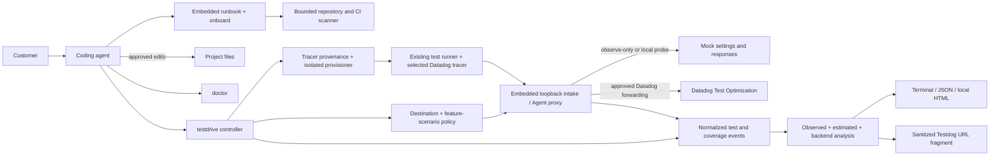

# Agent-driven, zero-account onboarding for DDTest

Status: proposed

Working product name for the report viewer: **Testdog**

Last updated: 2026-09-09

## Executive summary

DDTest should become the shortest path from “I have a test suite” to “I can see what Datadog Test Optimization would do for me.” A customer should be able to ask a coding agent to set it up, run the customer's real tests, and receive useful evidence without first creating a Datadog account or finding an API key.

The proposed experience has three product commands:

- `ddtest onboard` performs bounded, static repository and CI discovery and gives the agent a validated setup plan.
- `ddtest doctor` diagnoses the resulting configuration with stable check IDs, evidence, and one concrete next action per finding.
- `ddtest testdrive` runs an approved test plan, captures real Test Optimization events locally, validates the setup, analyzes the suite, and reports likely value.

DDTest ships a versioned runbook inside the binary. The customer's agent follows that runbook, but deterministic DDTest code—not the agent—owns framework detection, command construction, test selection, local intake behavior, result semantics, and redaction. This borrows the strongest property of the `dd-trace-js` validation runbook while fixing its discoverability problem.

DDTest also owns tracer bootstrap. A tracer installed only by CI auto-instrumentation is a valid and common setup; it must not force the customer to add the tracer to the application just to run a local testdrive. `onboard` identifies the CI tracer source and selects one exact, supported version. After approval, `testdrive` installs that version into an isolated DDTest-managed runtime and injects it by absolute path. It never substitutes an unrelated latest version or modifies the project's dependency manifest merely to validate CI injection.

`testdrive` always uses an embedded loopback collector. A tracer/version adapter can address it through agentless intake with a dummy API key or through the Datadog Agent's Test Optimization EVP interface; this is an implementation compatibility choice, not a user-visible mode. In local mode the collector returns mock control-plane responses and no Datadog credentials are needed. In Datadog mode it records the same local evidence and forwards an allowlisted set of requests to the real backend. The test subprocess always talks to loopback, so switching destinations does not require reinstrumentation or a new test command.

Every result distinguishes three kinds of claims:

- **Observed:** this run directly proved it, such as tracer initialization, event hierarchy, test counts, failures, durations, and coverage payloads.
- **Estimated:** DDTest modeled it from local coverage and a stated change set, such as possible TIA savings.
- **Backend-verified:** Datadog returned or accepted it, such as feature settings, actual skippables, historical durations, or an accepted intake request.

This distinction is essential. A local mock can prove that the customer's integration and DDTest's selection path work, but it cannot prove what the production TIA backend will select from its historical state.

## Product thesis

The activation loop should be:

> Run real tests locally → see a product-shaped result → fix setup problems → estimate value → add credentials and send the same data to Datadog.

This is the pattern that makes Lapdog compelling: real user data, a useful local UI, no account, and an additive switch to Datadog forwarding. Testdog should apply that pattern to tests rather than offer another setup wizard or a canned demo.

The customer's coding agent is the operator, not the source of truth. Agents are good at explaining findings, obtaining approval, and making repository-specific edits. They are not reliable enough to independently infer every package-manager command, wrapper chain, CI environment, framework option, or Test Optimization result. DDTest must narrow those choices and validate them.

MCP can later expose the same primitives, but it should not be the primary onboarding contract. Requiring a configured MCP server before product setup creates a circular dependency, is client-specific, and still leaves command construction and result interpretation vulnerable to agent mistakes.

### What to borrow from Lapdog

The relevant Lapdog loop is not merely the dog name or a polished page:

1. one small install/wrapper change;
2. the user's own workload appears immediately, without an account;
3. the local result looks like the product, not like protocol debug output;
4. forwarding to Datadog is additive rather than a second instrumentation project;
5. the result is easy to show another person.

Testdog maps those steps to install → agent-guided setup → real suite report → sanitized share → approved Datadog forwarding. The personal result is the acquisition surface: “these are *your* 17 slow suites and a typical 48% estimated opportunity” is more compelling than generic Test Optimization documentation.

There is no public evidence here that attributes Lapdog conversion to any single mechanism, so “viral” is a product hypothesis rather than a measured causal claim. DDTest should instrument the part it can measure without weakening local privacy: install/downloads, opt-in static-viewer opens, time to useful report, share creation, later Datadog-mode activation, and time to a non-empty backend TIA plan.

## Goals

1. Let an agent take a supported repository from no DDTest configuration to a locally validated setup.
2. Require no Datadog account, API key, separately installed Agent, or Datadog network connection for the local value loop.
3. Support CI-only auto-instrumentation without requiring a local project dependency, while proving which exact tracer was tested.
4. Prove whether a real project test works cleanly and with Test Optimization instrumentation.
5. Trace and analyze the real suite immediately after the smoke check, subject to an explicit execution approval.
6. Show actionable suite insights even when TIA savings cannot be estimated.
7. Estimate TIA and, in a later milestone, parallelization value locally without presenting an estimate as a backend decision.
8. Make adoption incremental: commit the validated changes, push them, set `DD_API_KEY`, and rerun the same workflow against Datadog.
9. Detect likely differences between the local runtime and the CI runtime, and select a CI runtime profile only when its provenance and confidence are clear.
10. Give agents stable JSON, stable exit semantics, explicit capabilities, and exact next actions rather than prose they must scrape.
11. Produce a visual, shareable result without uploading source paths, test names, failures, or repository identity by default.

## Non-goals

- Reimplement the production TIA algorithm or claim that a local estimate is the result Datadog will return.
- Automatically create a Datadog account, API key, secret, or organization-level permission.
- Execute package installation, project setup, tests, browsers, services, or arbitrary wrapper commands during the static onboarding phase.
- Make an agent interpret arbitrary repository text as instructions.
- Fully understand every CI DSL, monorepo orchestrator, remote reusable workflow, or dynamic shell expression in the first release.
- Require the hosted viewer for success. Terminal, JSON, Markdown, and a local HTML report remain first-class.
- Query historical flakes or regressions with an application key in the MVP. Those are optional backend enrichments.

## Design principles

### Value before credentials

Local mode must use the customer's real suite and real Datadog tracing library. The mock exists only at the transport and control-plane boundary. A toy project or screenshot does not prove compatibility or show personal value.

### Deterministic core, agentic shell

The runbook tells the agent when to inspect, explain, edit, ask for approval, and retry. DDTest code selects safe candidates, builds exact commands, owns temporary fixtures, captures payloads, and decides result states.

### One setup, two destinations

Local and Datadog modes use the same instrumentation, test command, selected loopback transport adapter, report schema, and analyzer. The only intentional delta is the collector's response/forwarding policy and the parent's credentials.

### Partial conclusions survive

A blocked browser must not erase a valid static CI finding. An incomplete CI audit must not erase a successful local tracer check. Results are independent verdicts, not one undifferentiated red or green status.

### Conservative estimates

Unknown coverage, changed test files, new tests, unskippable markers, and configured tracked files all force tests to run in the local model. If confidence is low, DDTest says so and explains why.

### Safe and reversible by construction

Static discovery is bounded and inert. Test execution is checksum-bound to an approved plan. Temporary files are enumerated and cleaned. Local intake binds only to loopback. Raw events are ephemeral unless explicitly retained.

## Proposed customer journey

The happy path should look like this:

```text
Customer: “Make my tests go brr with the Datadog thing.”

Agent:
  brew install ddtest
  ddtest help
  ddtest onboard --format=json

Agent explains detected framework, CI job, CI tracer source/version, proposed files, and limitations.
Customer approves the edits.
Agent edits only the required project or CI files. A CI-only tracer does not become a project dependency.

Agent:
  ddtest doctor --format=json
  ddtest testdrive --print-plan --backend=auto

Agent presents the exact tracer package/version and provenance, isolated install
path, registry host if a download is needed, test command, scope, timeout,
listener capability, mutable paths, cleanup, and selected destination.
Customer approves once.

Agent:
  ddtest testdrive --run-approved-plan ... --sha256 ...

DDTest:
  Setup                         PASS       observed
  Basic test reporting           PASS       observed
  Per-test coverage              PASS       observed
  TIA skip application           PASS       observed in isolated probe
  Current-change TIA estimate    0%         dependency change; global impact
  Historical replay median       48%        estimated across 17 eligible commits
  Typical expected wall time     11m → 6m   replay estimate with 4 workers
  Datadog backend                NOT USED   local mode
  Next action: commit and push, then set DD_API_KEY in the CI test job.
  Report: .testoptimization/testdrive/.../report.html
  Share:  https://testdog.ai/#r=v1....

Agent fixes any findings, reruns doctor/testdrive, commits, and pushes.
With DD_API_KEY present, --backend=auto selects Datadog and the same flow
reports actual settings, skippables, and historical duration data.
```

The first CI change should be small. Onboarding initially replaces or wraps the existing test command with a single-node `ddtest run`, preserving the job's current environment. After the report demonstrates value, the agent may offer the more invasive `ddtest plan` plus dynamic CI matrix/fan-out change as a separate optimization. The GA distribution target is the exact `brew install ddtest` command; a Datadog tap can be the pre-core preview path but should not leak into the long-term onboarding story.

## Agent runbook

### Distribution and discovery

The runbook is embedded in the DDTest binary with `go:embed` and is released with the exact implementation it describes. It is available through:

```text
ddtest runbook onboarding --print
ddtest runbook onboarding --extract=<declared-path>
```

Because an embedded resource has no stable filesystem path, `--print` writes it to stdout and `--extract` is an explicit, bounded write. JSON output also includes the DDTest version and runbook content digest.

Root `ddtest help` includes a prominent line for coding agents: `Start with: ddtest onboard`. `ddtest onboard` includes the next exact runbook command in both human and JSON output. The public docs and a future `llms.txt` repeat this entry point.

This fixes a gap in the `dd-trace-js` precedent: its runbook is correctly shipped next to the installed tracer version, but an agent must already be told its path. DDTest is the cross-language entry point and should make discovery unavoidable.

### Safety protocol

The runbook follows this state machine:

1. **Inspect:** static, bounded discovery; no project code or network; writes only declared onboarding artifacts.
2. **Select evidence:** the agent may choose only IDs already discovered by DDTest and may add inert CI evidence in schema-approved fields.
3. **Propose edits:** the agent shows repository diffs and explains unresolved evidence.
4. **Validate manifest:** DDTest rejects executable fields, out-of-repository paths, changed evidence inputs, and unsupported selections.
5. **Print execution plan:** DDTest enumerates exact commands, working directories, environment keys, timeouts, capabilities, output paths, and cleanup targets.
6. **Approve once:** the agent asks for approval using the prescribed prompt.
7. **Execute exact plan:** a SHA-256 digest binds the manifest, DDTest version, relevant project files, executable identity, non-secret environment values, commands, fixtures, destination/site, capabilities, and mutable paths. Secret values are excluded, but their presence and a non-reversible keyed fingerprint are bound so a credential change invalidates approval without exposing the credential.
8. **Interpret and stop:** the agent reports independent verdicts and the first concrete next action. Any correction or retry requires a fresh plan and approval.

Repository files, package scripts, CI configuration, test output, and generated failures are untrusted evidence. They are never treated as runbook instructions. Agent-editable manifest sections cannot contain `argv`, shell fragments, setup commands, wrapper commands, or new file paths.

## CLI contract

### `ddtest onboard`

`onboard` is the safe, static discovery and planning command.

It detects:

- language and framework candidates, including multiple workspaces;
- project-installed tracer packages and versions from repository-contained manifests/locks;
- CI auto-instrumentation installers, version selectors, tracer paths, and literal pins;
- direct framework runner and an existing representative test plus bounded fallbacks;
- the effective DDTest command and framework options;
- relevant CI files/jobs and visible Test Optimization wiring;
- literal OS/runtime evidence from runner labels, containers, setup actions, and version files;
- prerequisites such as a browser, localhost service, generated build output, or database;
- proposed dependency, instrumentation, test-command, artifact, and ignore-file changes.

It does not install dependencies, import project modules, load dynamic configuration, start services, run tests, or contact Datadog.

The default invocation creates a versioned, ephemeral manifest under `.testoptimization/onboarding/` and prints a summary. It also proposes a durable, checked-in `ddtest.yaml` containing only the selected platform/framework IDs, supported runner options, CI target, and runtime-profile references. The manifest is evidence for one onboarding attempt; it is not required in a fresh checkout. `--format=json` writes only the result document to stdout; progress goes to stderr. `--print-plan` creates the checksum-bound execution plan.

The manifest has a CLI-owned `observed` section and a constrained `agent_selection` section. The latter may reference only discovered candidate IDs and contain bounded inert evidence. This allows an agent to resolve a dynamic-looking CI job without allowing it to smuggle a command into the executor.

#### Tracer provenance and acquisition

Tracer availability and Test Optimization configuration are separate checks. `onboard` classifies each selected workspace into one of these states:

| Observed state | `onboard` result | `testdrive` behavior |
| --- | --- | --- |
| Project tracer and CI use the same exact supported version | `PROJECT_EXACT` | Reuse the project installation after verifying its resolved physical path and version. |
| CI pins a supported tracer but it is absent locally | `CI_INJECTED_EXACT` | Provision that exact version into the DDTest runtime and inject it by absolute path. |
| CI uses a floating selector such as `latest` or an unbounded major | `CI_INJECTED_FLOATING` | Propose an exact certified pin. Test only that pin and do not claim CI parity until the CI patch uses it. |
| No tracer is configured yet | `NOT_CONFIGURED` | Select an exact version from DDTest's embedded compatibility matrix and use the same pin in the proposed CI setup and testdrive. |
| Project and CI versions conflict, or the CI version is dynamic/unsupported | `CONFLICT` or `INCOMPLETE` | Do not silently choose one. Give the agent one concrete pin/upgrade action and require a fresh plan. |

`onboard` remains static and never installs anything. Version choice therefore comes only from repository evidence or the exact, release-tested defaults embedded in DDTest; it does not perform a registry lookup and call the result reproducible. The observed version selector, selected exact version, evidence location, intended runtime, and confidence are part of the manifest.

When the selected tracer is not locally available, `testdrive --print-plan` adds a `provision_tracer` step. The approved step is constrained by a language-specific adapter and binds the package identity, exact version, registry origin, target directory, expected project-file mutations (normally none), lifecycle-script policy, and cache behavior. Credentials used by a package registry are redacted and are never inherited by the test process. A missing network, private-registry authentication failure, checksum/integrity failure, or unavailable runtime produces `TRACER_PROVISIONING_BLOCKED`; there is no fallback to `latest`.

The provisioned tracer lives in an isolated, content-addressed DDTest runtime, not in the customer's dependency tree. DDTest verifies the resolved version and initialization entrypoint after installation and records them in the result. The approved test command receives an absolute preload/plugin path, so language resolution does not depend on the tracer appearing in the project's lockfile. The cache can be reused only for the same tracer artifact, runtime family, OS, and architecture; each testdrive still gets an isolated mutable run directory.

The first JavaScript adapter follows the existing Test Optimization auto-installation shape: install `dd-trace@<exact-version>` under an isolated prefix, then preload `<prefix>/lib/node_modules/dd-trace/ci/init` by absolute path. Vitest additionally receives the certified absolute ESM registration path. This mirrors CI-only installation without changing `package.json`, `package-lock.json`, `yarn.lock`, or `pnpm-lock.yaml`. Other languages get explicit adapters rather than a generic package-manager command language; adapters that cannot isolate safely are not advertised until they can.

The final setup verdict deliberately remains split:

- `LOCAL_TRACER_COMPATIBILITY` proves that the selected exact tracer can instrument a real project test locally.
- `CI_WIRING` proves only what bounded static CI evidence supports.
- `CI_TRACER_PARITY` is `PASS` only when CI and testdrive use the same exact tracer and compatible runtime profile.
- `DATADOG_DELIVERY` is not observed until an approved Datadog-mode run or the instrumented CI job reports backend evidence.

This avoids claiming that a local run proved an injected CI environment that was never executed.

### `ddtest doctor`

`doctor` is a read-only check engine and is safe to rerun after every edit.

Default checks are static. `--live` adds network or executable probes and therefore appears in an approval plan. Checks return `PASS`, `WARN`, `FAIL`, or `INCOMPLETE` with:

- a stable check ID;
- an evidence class;
- the observed value and provenance;
- the expected condition;
- affected files/locations;
- a machine-readable blocker category;
- exactly one first remediation action;
- whether the action is safe to autofix or requires approval.

Initial checks include:

| Area | Executor | Examples |
| --- | --- | --- |
| Compatibility | static | supported framework, runner, tracer installed, centralized minimum-version check |
| Instrumentation | static + imported testdrive evidence | Ruby `RUBYOPT`, Python pytest plugin, JavaScript `NODE_OPTIONS`, effective child environment |
| Test command | static | direct supported runner, options retained, no ambiguous wrapper or stripped `--` arguments |
| CI wiring | static | initialization and transport visible in the selected job, variables propagate to the final process |
| Identity | static + imported testdrive evidence | repository, service, branch, commit, session name, working directory |
| Runtime profile | static + imported testdrive evidence | execution profile versus selected CI TIA profile, provenance and confidence |
| DDTest | static | platform/framework selection, discovery pattern, worker configuration, plan freshness |
| Backend | `--live` or imported testdrive evidence | mode, destination, authentication accepted, settings/features, data availability |
| Repository | static | generated artifact ignore rules, commit present, push/upstream state for real TIA |

`doctor --live` may create backend request records and must say so in its approval plan. A normal `doctor` never upgrades a static inference into a live verdict; it can only import signed/fresh evidence from a completed testdrive.

Live doctor uses the same two-step contract as testdrive:

```text
ddtest doctor --live --print-plan
ddtest doctor --live --run-approved-plan=<path> --sha256=<digest>
```

Doctor must be able to diagnose missing Git instead of failing in a global pre-run hook.

### `ddtest testdrive`

Key options are:

```text
--backend=auto|local|datadog   default: auto
--scope=smoke|suite            default: suite
--changes=auto|working-tree|HEAD~N|<base-ref>  default: auto
--replay-history=<count>        default: 20 eligible commits
--exercise=none|tia|all         default: tia
--runtime-profile=<id>
--format=human|json
--output=<directory>
--keep-raw                     explicit, sensitive debug artifact
--print-plan
--run-approved-plan=<path> --sha256=<digest>
```

`auto` selects `datadog` when `DD_API_KEY` is present and the destination resolves through a Datadog-owned site allowlist; otherwise it selects `local`. The plan prints the selected mode, site, identity, and upload categories before approval. Approving that exact plan is explicit upload consent; merely running `onboard`, `doctor`, or `testdrive --print-plan` never uploads. The API key value is never printed, stored in the manifest, or passed unchanged to the test subprocess.

Before running project code, the executor verifies or provisions the manifest-selected tracer. Provisioning may use the network and execute package installation logic, so it occurs only in the approved execution path and is displayed independently from the customer test command. It runs outside the customer project dependency tree and must leave the project manifest and lockfiles byte-for-byte unchanged.

The executor takes a complete environment mutation with explicit set and unset operations; appending key/value pairs to `os.Environ` is insufficient. Command construction is independent of instrumentation. The clean baseline removes only known Datadog tokens from `RUBYOPT`, `PYTEST_ADDOPTS`, and `NODE_OPTIONS`, scrubs inherited Datadog destinations/credentials, and preserves unrelated project options. If a pre-existing wrapper cannot be separated safely, the baseline is `INCOMPLETE` instead of pretending to be clean.

The default suite plan contains a cheap uninstrumented representative test target—initially often a test file—the same target with instrumentation, one observe-only instrumented suite run, and an isolated TIA behavior probe. It does not run the full suite twice. `smoke` omits the customer's full suite but still runs a requested isolated probe; it is useful for expensive or prerequisite-heavy projects. `--exercise=none` records `NOT_REQUESTED`, which does not affect success. A requested probe that cannot conclude is `NOT_EXERCISED` and makes the selected workflow incomplete (`2`).

`suite` is deliberately the default because immediate suite analysis is the product promise; the exact command, expected scope, and timeout are still shown before approval, and the agent can propose `smoke` when discovery identifies expensive prerequisites.

Exit codes follow the `dd-trace-js` validator precedent:

- `0`: selected checks concluded, no actionable setup issue, and the test command passed;
- `1`: a confirmed actionable setup issue or test failure; the JSON result differentiates them;
- `2`: incomplete or blocked, while preserving completed conclusions;
- `3`: DDTest orchestration or implementation error.

The underlying test exit code is always recorded separately in the result document.

## Architecture



Proposed internal components:

| Component | Responsibility |
| --- | --- |
| `internal/onboarding` | bounded scanners, manifest schema, evidence selection, plan/approval generation |
| `internal/doctor` | composable checks, blocker taxonomy, remediation results |
| `internal/testdrive` | state machine, child process lifecycle, clean/instrumented comparison, mode selection |
| `internal/testdrive/provision` | tracer provenance, exact-version selection, isolated language installers, verified absolute initialization paths |
| `internal/testdrive/intake` | loopback HTTP server, mock responses, allowlisted forwarding, draining |
| `internal/testdrive/protocol` | lossless JSON/MessagePack/multipart/gzip decoding and normalized event types |
| `internal/testdrive/analysis` | suite statistics, coverage graph, TIA simulation, historical replay, parallelism scenarios |
| `internal/ciprofile` | profile candidates, provenance/confidence, selection and mismatch checks |
| `internal/report` | versioned public result DTO and human/JSON/Markdown/HTML/share renderers |
| `internal/runbook` | embedded versioned Markdown and discovery metadata |

The existing `framework.Framework`, planner dependency seams, process-group cancellation, platform instrumentation environments, and planning analytics should be reused. Human report text must not be parsed; the planner and runner need structured result APIs.

## Local intake: build from Shepherd's proven mockdog contract

The Shepherd checkout already contains a working cross-language local backend in `tools/mockdog`. It proves that the proposed local mode is technically viable and eliminates a from-scratch protocol spike. A smaller compatibility spike is still required to certify every supported tracer/version and fill missing transport surfaces.

Relevant Shepherd implementation:

- `tools/mockdog/internal/server/server.go` binds `127.0.0.1` and registers direct, EVP proxy, APM trace, control-plane, and report endpoints.
- `tools/mockdog/internal/handlers/handlers.go` returns scenario-shaped settings/skippables and drains asynchronous payload processing before reporting.
- `tools/mockdog/internal/payload/` decodes JSON, gzip, MessagePack, and multipart test/coverage payloads.
- `tools/mockdog/internal/model/test.go` normalizes test, suite, module, session, runtime, Git, feature, duration, and status fields.
- `tools/mockdog/internal/report/` aggregates lifecycle and intake evidence.
- `config/targets.yaml` demonstrates both direct agentless targeting and a local-Agent target. Its default mockdog target is useful test infrastructure, but its agentless environment is not the product isolation contract proposed below.
- `config/scenarios/coverage-enabled.yaml` is almost exactly the observe-only scenario testdrive needs.

The DDTest implementation should extract and productionize this contract, not shell out to a separately installed `mockdog` binary. An embedded server can keep the kernel-assigned `127.0.0.1:0` listener open, eliminating Shepherd's reserve-then-rebind race and an extra installation/lifecycle step.

Shepherd proves the handlers, decoders, response scenarios, and reporting model, but it is not copied unchanged. Its current mockdog exposes most EVP routes under v4, its `/info` response lists individual API endpoints rather than an EVP base, and its default local target uses agentless overrides. DDTest must complete whichever surfaces its compatibility matrix selects; using EVP for a tracer requires the full v2 surface and Agent discovery response below.

Before implementation, the DDTest and Shepherd owners should choose one code-ownership model:

1. move the reusable protocol/intake core into a small shared Go module used by both projects; or
2. bring the minimal core into DDTest with attribution and make Shepherd run compatibility/golden tests against it.

Indefinitely maintaining two independent protocol decoders is the least desirable option.

### Intake surface

The embedded collector needs a subset already demonstrated by mockdog. Each handler is exposed directly and, when the selected tracer adapter needs it, below an EVP prefix:

| Endpoint family | Purpose |
| --- | --- |
| `/api/v2/citestcycle` | session/module/suite/test events |
| `/api/v2/citestcov` and `/api/v2/cicovreprt` | per-test/file coverage and coverage reports |
| `/api/v2/libraries/tests/services/setting` | feature settings |
| `/api/v2/ci/tests/skippable` | test/suite skip response |
| `/api/v2/ci/libraries/tests` | known tests/EFD |
| `/api/v2/test/libraries/test-management/tests` | test management properties |
| `/api/v2/git/repository/search_commits` and `/packfile` | tracer/DDTest Git protocol |
| `/api/v2/ci/ddtest/test_suite_durations` | DDTest historical suite durations |
| `/api/v2/apmtelemetry` and telemetry proxy | tracer and DDTest lifecycle/health evidence |
| `/info`, `/v0.4/traces`, `/v0.5/traces` | Agent capability discovery and defensive APM capture |
| `/evp_proxy/v2/api/v2/...` variants | Agent/EVP transport adapter |

The observe-only local scenario returns TIA and code-coverage collection enabled, but test skipping, EFD, retries, and Test Management behavior disabled. The suite therefore runs normally while producing the data needed for analysis. Feature-specific behavior tests use separate, explicit scenarios and validator-owned fixtures; they never silently change the main suite's semantics.

For the Agent/EVP adapter, the minimum discovery response is:

```json
{
  "endpoints": ["/evp_proxy/v2/"],
  "config": {"default_env": "none"}
}
```

Under that prefix, `citestcycle` is a MessagePack event envelope and `citestcov` is multipart metadata plus MessagePack coverage. Preserve trace, span, session, suite, and test IDs as 64-bit integers; conversion through a generic floating-point JSON number breaks event-to-coverage correlation. Settings and selection endpoints use JSON. The MVP validates `X-Datadog-EVP-Subdomain` against an endpoint allowlist and acknowledges legacy trace endpoints with `{"rate_by_service":{}}`.

### Local transport adapters and child environment

DDTest owns a versioned transport-capability matrix. It selects the simplest adapter proven for the detected tracer version and records that choice in the approved plan and result:

| Adapter | Child overlay | When to use it |
| --- | --- | --- |
| Direct agentless | `DD_CIVISIBILITY_AGENTLESS_ENABLED=1`, loopback `DD_CIVISIBILITY_AGENTLESS_URL` and telemetry URLs, `DD_API_KEY=<per-run-dummy>` | Preferred when contract tests prove every Datadog endpoint family used by that tracer/version honors the loopback overrides. This is Shepherd's current default mockdog pattern. |
| Agent/EVP | `DD_CIVISIBILITY_AGENTLESS_ENABLED=0`, `DD_TRACE_AGENT_URL=http://127.0.0.1:<port>`, no child API key | Fallback when a tracer has incomplete agentless URL overrides, or when its Agent path has the better-tested protocol surface. |

Both overlays also set `DD_CIVISIBILITY_ENABLED=1`, enable ITR/coverage collection, disable behavior-changing features and unrelated remote configuration, route supported tracer telemetry to loopback, merge `127.0.0.1,localhost` into both `NO_PROXY` and `no_proxy`, and assign a unique testdrive correlation/session ID. They scrub inherited Datadog Agent, agentless, telemetry, site, API-key, and application-key destinations before applying the selected overlay. DDTest's own loopback client explicitly bypasses environment proxies. Any inherited real key is replaced by the dummy key or removed; it is never exposed unchanged to the child.

The intended product identity—service, repository, environment, bundle, and target TIA runtime tags—remains distinct from the run correlation ID. Local mode isolates caches by run directory and correlation ID without silently changing the identity under evaluation. Datadog control-plane requests must use the intended CI identity; otherwise backend settings, history, and skippables would be irrelevant.

Do not hard-code either adapter as a universal requirement. The acceptance test is behavioral: run each minimum supported tracer behind an outbound-network tripwire and prove that event, coverage, settings, Git, and telemetry traffic reaches only the owned listener. At the time of this design, Python 4.11.0's agentless Git client constructs `https://api.${DD_SITE}/api/v2/git` rather than using `DD_CIVISIBILITY_AGENTLESS_URL`; DDTest should therefore use EVP for that version unless the tracer adds a complete override. Ruby and JavaScript may use the simpler dummy-key path once the same test passes.

Adapter certification is exact and fail-closed: an unknown tracer version gets `LOCAL_TRANSPORT_UNCERTIFIED`, never the nearest known adapter. Certification is per scenario and covers every endpoint the enabled features can activate, including coverage reports, skippables, known tests, Test Management, and Git—not just the happy-path event upload. The agent may propose upgrading to a certified version; it may not waive the no-egress gate.

For the EVP adapter, advertise exactly `"endpoints": ["/evp_proxy/v2/"]` initially. The trailing slash is required by the minimum supported Ruby tracer. Ruby, Python, and JavaScript can all negotiate EVP v2, and advertising only v2 avoids gzip on the minimum supported Ruby and Python versions. Direct and EVP v4 routes remain protocol-test targets until the cross-language matrix proves them.

The settings response enables ITR and code-coverage collection while keeping skipping, retries, EFD, Test Management, and impacted-tests behavior disabled. The Git search response echoes submitted commit objects, marking them known and avoiding a packfile upload; a defensive packfile handler still accepts and discards a bounded upload.

This guarantees that supported-tracer Datadog product traffic stays local, regardless of the chosen adapter. It cannot guarantee that arbitrary customer tests themselves make no network calls, so the report must state the narrower guarantee accurately. Tests that run inside a container cannot reach host loopback without explicit networking; detect and report that as a capability blocker rather than silently changing transports.

### Production hardening beyond mockdog

Mockdog is a QA tool; the product path needs additional controls:

- bind only to loopback and never reuse an unrelated listener;
- use bounded request bodies and stream/spool large payloads rather than unbounded `io.ReadAll`;
- acknowledge quickly, parse asynchronously, then use an explicit drain plus request-quiescence deadline instead of a fixed sleep;
- decode 64-bit IDs losslessly so coverage `span_id` values reliably correlate with test events;
- reject path traversal and normalize only repository-relative coverage files;
- accept only known methods/paths/content types and cap decompression ratios;
- store the redacted result in a private run directory; keep raw events only with `--keep-raw`;
- fail open for the underlying test command if collection breaks, while marking validation incomplete;
- stop and reap the server/process tree on cancellation and signals;
- isolate every run's plan, HTTP cache, discovery output, and result directory so mock responses cannot contaminate a later Datadog run.
- accept evidence only for the approved service/session/correlation identity, validate `Host`, reject browser `Origin` requests, and classify unmatched local traffic as diagnostics rather than product proof;
- state the local-process threat boundary: code under test receives the collector address and can forge events, so testdrive validates integration behavior but is not a hostile-code attestation mechanism.

## Testdrive execution and analysis

Backend destination and feature scenario are orthogonal. Compatibility and suite-observation stages always receive an observe-only control-plane response so the full suite runs once without TIA, retries, quarantine, or disablement changing its behavior. In Datadog mode, approved customer event/coverage intake may still be forwarded and the parent separately fetches real settings and plan data, but those settings do not alter the observation pass. Validator-owned synthetic events never leave loopback. Exercising real backend behavior is a distinct stage with its own approval entry.

### Stage 0: tracer preparation

Resolve the approved tracer from either the verified project installation or DDTest's isolated runtime. If provisioning is required, install only the exact manifest-selected artifact through its language adapter, verify the package version and initialization entrypoint, and assert that project dependency files did not change. Record the source as `project` or `ddtest_managed`, together with the CI evidence it is intended to match. Stop with a typed blocker before running tests if provenance, compatibility, installation, or integrity cannot be established.

### Stage 1: preflight

Run one representative project test target without Datadog instrumentation. This separates a project/setup failure from a tracer regression. If it fails because of a shared prerequisite—missing build output, browser, service, database, runner, or host permission—stop the affected framework and report a typed blocker.

### Stage 2: compatibility proof

Run the same test with instrumentation and the local collector. Validate:

- the tracer loaded;
- at least one test event arrived;
- session, module, suite, and test identities form a complete hierarchy where the framework supports them;
- status and exit code agree;
- service/repository/runtime metadata are coherent;
- the process flushed without a transport error and, when locally routed telemetry exposes it, without dropped/serialization errors;
- enabling instrumentation did not introduce a deterministic failure.

If the clean run passes, the instrumented run fails, and a confirmation run fails the same way, classify it as a possible tracer compatibility problem. An intermittent confirmation is `INCOMPLETE`, not a confirmed regression.

### Stage 3: suite observation

Run the approved suite once with observe-only settings. Produce observed insights even if coverage is unavailable:

- number of sessions, modules, suites, tests, passes, failures, and framework skips;
- total and per-suite/test duration distribution;
- slowest tests and suites, long serial bottlenecks, and highly imbalanced files;
- framework/tracer version and the directional latency difference from the representative A/B sample, explicitly not a reliable overhead measurement;
- event drops, malformed payloads, missing hierarchy levels, duplicate IDs, or count mismatches;
- coverage payload count, covered repository files, tests with/without coverage, and coverage-map density;
- local/CI runtime-profile differences;
- one-node worker and multi-node parallelism scenarios using the existing DDTest planner model.

### Stage 4: local TIA simulation

For every correlated test, build `coverage(test) = {repository-relative files}` from `citestcov` and the test event's `span_id`. An explicit `--changes` always wins. In `auto`, use the complete working-tree/staged diff when present; otherwise use the last non-merge commit diff. Never hide dependency, lockfile, generated-code, or CI changes introduced during onboarding: if they match a global-impact rule, the current-change estimate may correctly be 0% savings.

A test is runnable if any of the following is true:

- its coverage intersects the changed files;
- it is new, failed, unskippable, or lacks usable coverage;
- its own test file changed;
- a changed file matches a conservative tracked/global-impact rule;
- the change cannot be classified safely.

Remaining tests are locally estimated as skippable. DDTest reports estimated test count, test duration, file count, wall time, and CI worker cost, together with the exact change set, granularity, fallback rules, coverage completeness, and confidence.

Alongside that primary result, the initial release always performs bounded historical replay when Git history is available. It applies the current coverage graph to up to `--replay-history` recent eligible commit diffs, excludes merges and global-impact/dependency changes from the typical-change cohort while reporting their excluded count, and reports a distribution rather than a single best-looking number. This gives the customer a useful value signal even when the onboarding lockfile change makes the current diff globally impacting. Because coverage and tests may have changed since those commits, replay is always labeled estimated.

The result keeps `execution_profile` (what actually ran locally) separate from `target_tia_profile` (for example Linux CI runtime tags). A target profile can be used for backend plan queries and labeled estimates; changing its tags does not make a macOS run an observed Linux validation.

### Stage 5: feature behavior probes

The launch workflow includes one isolated TIA skip-application probe after basic reporting succeeds. DDTest creates validator-owned skipped and control canaries under the approved temporary directory, discovers their exact identities, returns the skipped canary from the local skippables endpoint, then drives DDTest's real planner/runner path. The control sentinel must be written, the skipped sentinel must not be written, and the structured plan must attribute the omission to TIA. This validates DDTest's selection and execution path rather than merely proving that a tracer can consume its own skip response. A separate tracer-native subcheck can be reported when relevant.

The generated paths, commands, response fixture, sentinels, and cleanup are checksum-bound. Synthetic requests and events are forcibly non-forwardable even when `--backend=datadog`. Every verdict includes `component` (for example `ddtest_planner_runner`), `evidence_scope=local_synthetic`, and the scenario version. It does not claim production backend selection. If the framework cannot express the probe safely, the feature is `NOT_EXERCISED`, not falsely green.

`--exercise=all` can later apply the same validator-owned scenario model to EFD, Auto Test Retries, and Test Management. A Datadog-controlled behavior pass is separate from the observe-only suite pass because real settings can skip, retry, quarantine, or disable customer tests. It requires an explicit plan entry and reports its altered semantics.

The feature report never collapses configuration, modeled value, and behavior into one check:

| Feature | Launch evidence | Example verdict |
| --- | --- | --- |
| Basic reporting | real project target and suite events | `WORKING_OBSERVED` |
| Per-test coverage | captured suite coverage correlated to tests | `WORKING_OBSERVED` or `UNAVAILABLE` |
| TIA selection | local coverage/change model; optional real backend plan | `ESTIMATED` and, separately, `BACKEND_PLAN_RECEIVED` |
| TIA skip application | isolated validator-owned canaries through DDTest planner/runner | `WORKING_OBSERVED` with `local_synthetic` scope, or `NOT_EXERCISED` |
| EFD, retries, Test Management | backend settings and optional later probes | `BACKEND_ENABLED`, `NOT_EXERCISED`, or `UNSUPPORTED` |

Other states include `BLOCKED` and `FAILED_OBSERVED`. `BACKEND_ENABLED` means only that configuration was returned; it never means the behavior worked.

## Datadog mode and the conversion path

In Datadog mode the loopback collector becomes an allowlisted recording forward proxy:

1. the child still sends to loopback through the selected adapter, with either a dummy key or no key;
2. the proxy records normalized evidence;
3. it maps the fixed local path and, for EVP, `X-Datadog-EVP-Subdomain` to a fixed upstream class;
4. it strips Agent/local authentication and hop-by-hop headers, sets the upstream host, and injects the real API key held only by the parent process;
5. it forwards only recognized Test Optimization paths to the selected `DD_SITE` over TLS;
6. it records status, timing, and safe response fields, then returns either the backend response for a feature-behavior pass or the explicit observe-only response for a suite-observation pass.

The upstream map is code, not agent-editable manifest data:

| Local path family / EVP subdomain | Upstream origin | Upstream path |
| --- | --- | --- |
| `citestcycle` / `citestcycle-intake` | `https://citestcycle-intake.<allowed-site>` | `/api/v2/citestcycle` |
| `citestcov` / `citestcov-intake` | `https://citestcov-intake.<allowed-site>` | `/api/v2/citestcov` |
| `cicovreprt` / `ci-intake` | `https://ci-intake.<allowed-site>` | `/api/v2/cicovreprt` |
| settings, skippables, known tests, Git, Test Management, DDTest durations / `api` | `https://api.<allowed-site>` | corresponding allowlisted `/api/v2/...` path |
| APM telemetry | `https://instrumentation-telemetry-intake.<allowed-site>` | `/api/v2/apmtelemetry` |

Reject a path/subdomain mismatch instead of letting either value choose an arbitrary host. The site resolver owns the exact supported Datadog domains, including nonstandard site suffixes; string concatenation alone is not an allowlist.

This preserves the same local analysis and keeps the API key out of arbitrary test subprocesses. It also makes the switch from local to real a destination change rather than a reinstrumentation exercise.

Backend conclusions remain precise:

- a 2xx intake response means **transport accepted**, not necessarily that the event is query-visible;
- returned settings/skippables/durations are **backend-verified**;
- query visibility requires a supported read API and appropriate read credential, or a future correlation endpoint.

The MVP should reuse the settings, skippables, known-tests, Test Management, and suite-duration endpoints DDTest already calls. This yields immediate backend analysis without an application key:

- whether TIA, skipping, coverage, EFD, retries, and Test Management are enabled;
- actual skippable tests/suites for the selected runtime profile;
- historical p50 suite durations and resulting split recommendations;
- known/managed test counts;
- control-plane latency and failures.

Historical flake trends, duration regressions, and test ownership are a later enrichment. Prefer a narrow onboarding-summary endpoint over requiring a broad `DD_APP_KEY`; otherwise make those insights explicitly optional and permission-scoped.

### The “API key and it just works” gap

Reporting can work with an API key alone, but production TIA currently also depends on account-side activation and accumulated coverage/history. The desired one-delta conversion therefore needs one of:

- an account policy that automatically activates new test services;
- a backend API that safely enrolls the service when the key/account permits it; or
- an exact activation deep link and `BACKEND_ACTIVATION_REQUIRED` result when manual permission is required.

DDTest must not silently claim success when settings return TIA disabled. This backend/product decision is a dependency of the complete vision, not something the CLI can paper over.

## CI runtime profile resolution

TIA data is scoped by OS and runtime tags. A macOS local run can intentionally query or exercise a Linux CI TIA configuration, but it cannot call that an observed Linux execution. DDTest already accepts `--runtime-tags`; onboarding should turn this manual mechanism into a provenance-aware target-profile resolver while always recording the physical execution profile separately.

Profile precedence is:

1. explicit `--runtime-tags` or `--runtime-profile`;
2. an exact profile captured in a recent DDTest CI plan artifact;
3. a recent successful Datadog test-session profile, when a supported backend read path exists;
4. literal static CI evidence such as `runs-on`, container image, architecture, runtime setup action, and version file;
5. local detected tags.

Every target candidate contains values, source locations, timestamp where applicable, and confidence. DDTest auto-selects only one unambiguous high-confidence target in the printed plan. A matrix produces multiple candidates; the agent/user selects one or runs a testdrive for each. Dynamic expressions and unknown OS versions remain incomplete rather than being guessed.

The result always carries both:

- `execution_profile`: detected OS, architecture, and runtime of the machine that actually executed the tests;
- `target_tia_profile`: tags used for a backend plan query or a deliberate local behavior emulation.

When they differ, the report says `EMULATED_TARGET_PROFILE` and limits the claim: it can prove request identity and skip matching, not that the skipped test would behave the same on the target OS.

Onboarding should offer to stabilize the chosen profile in CI and save its ID for local reuse. A lightweight `ddtest runtime-profile capture` CI step can write the exact observed tags into the existing `.testoptimization` artifact. A future backend endpoint for “recent test configurations for this repository/service” would remove the artifact-download step and is the preferred long-term solution.

## Result model and reporting

The canonical result is a versioned DTO, not terminal text. A shortened example:

```json
{
  "schema_version": "1.0",
  "run": {"id": "...", "backend": "local", "transport_adapter": "agentless", "scope": "suite"},
  "profiles": {
    "execution_profile": {"os": "darwin", "arch": "arm64"},
    "target_tia_profile": {"os": "linux", "source": "github-actions", "mode": "emulated"}
  },
  "checks": [
    {
      "id": "instrumentation.event_hierarchy",
      "status": "pass",
      "evidence_class": "observed",
      "summary": "1 session, 1 module, 154 suites, 423 tests"
    }
  ],
  "features": [
    {"id": "basic_reporting", "verdict": "WORKING_OBSERVED"},
    {
      "id": "tia_skip_application",
      "component": "ddtest_planner_runner",
      "evidence_scope": "local_synthetic",
      "verdict": "WORKING_OBSERVED"
    },
    {"id": "early_flake_detection", "verdict": "NOT_EXERCISED"}
  ],
  "observed": {"tests": 423, "duration_ms": 39990},
  "estimates": [
    {
      "model": "local_tia_v1",
      "confidence": "medium",
      "change_set": "working-tree",
      "time_saved_percent": 0,
      "reason": "global-impact dependency change"
    },
    {
      "model": "historical_replay_v1",
      "eligible_commits": 17,
      "median_time_saved_percent": 48.0
    }
  ],
  "backend": {"status": "not_used"},
  "test_process": {"exit_code": 0},
  "next_action": {"code": "commit_and_configure_api_key"}
}
```

Renderers produce:

- a concise terminal report for humans;
- JSON on stdout for agents and automation;
- a detailed local Markdown/HTML report;
- optional raw diagnostics with explicit retention;
- a sanitized Testdog share payload.

Reports are `PENDING` while execution is active and atomically become `FINAL` after the collector drains and cleanup concludes. Agents must not summarize per-check conclusions from a pending report.

## Testdog viewer

The hosted viewer is a static visualizer, not an intake or data store. A successful run prints a URL shaped like:

```text
https://testdog.ai/#r=v1.<base64url(deflate(canonical-json))>
```

The payload belongs in the URL fragment, not the path or query, so it is not included in normal HTTP requests or server logs. Fragments still appear in browser history, extensions, screenshots, and copied links, so sanitization—not URL mechanics—is the security boundary.

The default share schema contains only aggregate counts, rounded durations/percentages, evidence classes, confidence, generic finding codes, DDTest version, and an optional user-authored title. It excludes repository URLs, organization/service names, paths, test/suite names, branches, commits, environment variables, commands, failures, stack traces, and raw tags. Detailed inclusion requires an explicit `--share-details` confirmation.

Use a strict compressed-size limit and fall back to the local HTML report when exceeded. The viewer validates schema/version and renders no arbitrary HTML. It should visually emphasize the before/after story—purple gradient and sparkles are welcome—but must always show whether a number is observed, estimated, or backend-verified.

A live browser connection to localhost is not required. This avoids CORS/private-network restrictions and Safari/HTTPS-to-localhost problems seen by Lapdog. The core report also works offline.

## Security and privacy requirements

- Static onboarding reads only bounded repository-contained paths and does not follow escaping symlinks.
- Tests and project runners are arbitrary code. Their exact execution and required capabilities must be approved.
- The initial local server binds to `127.0.0.1` only and uses a kernel-selected port held by the same process.
- Local mode never forwards Datadog product traffic and replaces any inherited API/application key in children.
- Datadog mode shows site, service/repository identity, and upload categories before approval; it never shows the key.
- Forwarding is path-allowlisted, strips hop-by-hop headers, overwrites authentication/host, enforces TLS for non-loopback destinations, and has body/time/retry limits.
- Raw payloads, commands, environment values, and failure output are sensitive. They are omitted from shared output and private on disk.
- Unknown binary payloads are not persisted. Parse errors retain bounded metadata, not an unlimited raw body.
- Generated tests/fixtures live under one declared directory and cleanup never follows links or removes pre-existing files.
- A single-flight lock prevents two testdrives from sharing plans or intake state.
- `.testoptimization/` is generated and should be added to `.gitignore` during onboarding unless the project intentionally versions part of it.
- Local usage telemetry is captured by the local collector and not forwarded by default. Product-funnel telemetry begins only after the user approves a plan that selects Datadog mode; the static viewer may have separate transparent aggregate page analytics.

## Changes required in the current DDTest codebase

The current implementation has useful seams, but it assumes setup is already complete and is not yet an agent-facing workflow.

1. **CLI lifecycle:** only `plan` and `run` exist, command handlers call `os.Exit`, and a global pre-run Git check would prevent doctor from diagnosing missing Git. Move to `RunE`, typed command results, and per-command prerequisites.
2. **Configuration:** platform/framework default to Ruby/RSpec rather than being discovered. Settings initialization exits on the first parse error and has no checked-in config model. Introduce an error-returning loader, candidate detection, and durable `ddtest.yaml`; preserve existing flags/env compatibility.
3. **Compatibility registry:** centralize tracer/framework minimum versions. Today Python's code and README disagree, and JavaScript checks resolvability but not the documented minimum version.
4. **Structured planner/runner results:** planner analytics already know discovery counts, slow suites, estimated durations, skips, and split candidates, but much of the report model is private. Runner returns only an error and a small human report. Export a versioned internal result model and event sink instead of scraping output.
5. **Fresh session paths:** constants point to global `.testoptimization` locations and `run` can reuse an existing plan based on one file's presence. Testdrive must force an isolated plan/cache/result namespace and validate freshness/config identity.
6. **Backend health:** Test Optimization client initialization logs settings failures and still returns `nil`. Add typed transport/auth/settings results so doctor can distinguish unauthorized, unreachable, disabled, empty, cached, and malformed states.
7. **Per-session destination:** telemetry clients are currently created before command work, while planner/API clients derive routing from global settings. Resolve local/Datadog mode first and inject one per-session transport into DDTest telemetry, planner, and Test Optimization clients.
8. **Discovery reuse:** credential-free full discovery already uses tracer-owned discovery mode, a dummy API key, and a filesystem output. Reuse it for identities, but do not confuse discovery with executing/timing/tracing the suite.
9. **Framework execution:** replace append-only environment handling with explicit set/unset/full-environment semantics, separate base command construction from instrumentation overlays, keep process-group cancellation, return structured execution metadata, and capture bounded output separately from JSON stdout.
10. **Tracer provisioning:** replace JavaScript's unconditional project-local `require.resolve` assumption with a selected initialization path. Add exact-version provenance and isolated installers modeled on the Test Optimization install script, while guaranteeing that testdrive does not mutate customer dependency files.
11. **Distribution:** add an official Homebrew formula/tap and release automation so the advertised install command is real.
12. **Documentation:** invert the current prerequisite language. Local exploration no longer requires Test Optimization to be preconfigured; Datadog mode does.

## Delivery plan

### Phase 0: foundations and contract tests

- Decide shared ownership/extraction of Shepherd mockdog code.
- Introduce `Result`, `Check`, blocker, evidence, and exit-code schemas.
- Refactor config loading and Cobra handlers to return errors/results.
- Add per-session artifact paths and cache isolation.
- Centralize the support/version matrix.
- Add the tracer provenance schema and a fixture-only isolated provisioner with project-mutation and version-integrity checks.
- Add explicit environment set/unset semantics and injected per-session transports.
- Build direct-agentless and Agent/EVP golden protocol fixtures, including an outbound-network tripwire.

Exit criterion: a hidden development command can run a fixture tracer against the embedded collector with no external Datadog request and produce a final JSON result.

### Phase 1: one end-to-end setup proof

- Start with one language/framework pair and its CI-only installation adapter rather than building three horizontal scanners before any user sees value. JavaScript/Jest is the preferred first slice because an isolated Node prefix and absolute `dd-trace/ci/init` preload directly exercise the missing CI-only bootstrap path; Ruby/RSpec remains the fallback if implementation discovery invalidates that assumption.
- Embed and expose the runbook.
- Add the bounded framework/tracer/conventional-GitHub-Actions scanner and durable `ddtest.yaml`.
- Detect project-installed, exactly pinned CI-injected, floating CI-injected, and absent tracer states.
- Implement the exact-version isolated tracer adapter and produce the same pin in the proposed CI auto-instrumentation patch.
- Add immutable observed manifest plus constrained agent selections.
- Implement checksum-bound plans, static doctor, clean/instrumented preflight, and one observe-only suite capture.
- Export terminal, JSON, Markdown, and local HTML reports.
- Add Homebrew distribution.

Exit criterion: without credentials or a project-local tracer dependency, an agent can configure one conventional repository for CI auto-instrumentation and produce a report proving the exact tracer loaded, real test events and coverage arrived locally, the test outcome remained correct, the proposed CI wiring is statically coherent, and project dependency files were not changed. Parallelization, savings estimates, historical replay, and synthetic TIA behavior are explicitly outside this milestone.

### Phase 2: generalize the supported matrix

- Certify and add Python/pytest and supported JavaScript framework transport/discovery adapters.
- Expand conventional CI adapters based on bounded fixture evidence; report dynamic cases as incomplete.
- Normalize cross-language event hierarchy, duration, status, telemetry, coverage, and feature verdicts.
- Add local TIA simulation and harden historical replay. Add parallelism scenarios only after setup and TIA evidence are trustworthy.

Exit criterion: each advertised tracer/framework combination passes the no-Datadog-egress contract and produces either a complete local report or an explicit stable blocker.

### Phase 3: Testdog sharing

- Add the versioned sanitized share schema and static viewer.
- Add report schema compatibility tests and hostile-payload rendering tests.

Exit criterion: a share link contains no default-sensitive fields and faithfully labels all evidence classes.

### Phase 4: Datadog forwarding and conversion

- Add allowlisted forwarding, authentication isolation, backend status, and response capture.
- Surface real settings, skippables, known/managed tests, and suite durations.
- Add runtime-profile resolution from exact artifacts and, when available, a backend recent-profile endpoint.
- Add an activation deep link or enrollment API result.
- Offer the advanced multi-node CI patch after a successful single-node adoption.

Exit criterion: after commit/push and `DD_API_KEY`, the same testdrive reports backend-verified settings and actual plan data without changing instrumentation or the test command.

### Phase 5: advanced feature validation and backend enrichment

- Add validator-owned EFD, retry, and Test Management exercises; expand the launch TIA probe to real-backend behavior where safe.
- Add optional permission-scoped flake, ownership, and performance-regression analysis.
- Expand bounded CI adapters based on observed demand.

## Verification strategy

Every implementation change follows the repository requirement to run `make test` and `make lint`.

Test layers:

1. **Unit:** manifest validation, forbidden executable fields, check semantics, redaction, path containment, compression limits, change classification, coverage correlation, parallelism math.
2. **Protocol golden:** direct and EVP paths; JSON, gzip, MessagePack, and multipart; tracer-specific ID/value encodings; malformed/oversized/decompression-bomb inputs.
3. **HTTP contract:** settings/skippable/known/test-management/durations envelopes, headers, forwarding allowlist, backend errors, timeouts, retries, auth replacement, no secret persistence.
4. **Process lifecycle:** cancellation, process groups, listener ownership, parallel workers, drain/quiescence, crash/fail-open behavior, cleanup, and single-flight locking.
5. **Repository fixtures:** small Ruby/RSpec, Ruby/Minitest, Python/pytest, and every supported JavaScript framework fixture for static discovery and smoke execution.
6. **Shepherd E2E:** run representative real-world suites against released DDTest local mode and compare payload/report expectations. This becomes the cross-language compatibility gate.
7. **Security:** hostile repository files, symlink/hardlink attacks, ANSI/control characters, HTML injection, secret-looking environment/output, oversized share payloads, and attempts to forward unknown endpoints.
8. **No-network:** instrument DNS/HTTP in local-mode tests and assert that all Datadog destinations resolve to the owned loopback listener.
9. **Datadog canary:** opt-in staging tests verify accepted uploads, settings, actual skippables, and report links without becoming a required local test dependency.

## Success measures

Proposed launch targets:

- a conventional supported repository reaches a useful local report within ten minutes once its normal dependencies are present;
- at least 80% of the launch fixture corpus needs no manual correction to language/framework/runner selection;
- every `FAIL` and `INCOMPLETE` result has a stable code and a concrete first action;
- local mode makes zero requests to a Datadog-controlled endpoint;
- a clean/instrumented mismatch is reproducible before being labeled a compatibility regression;
- every displayed savings number carries change-set, evidence-class, granularity, and confidence metadata;
- the default share fragment contains none of the sensitive-field corpus;
- switching to Datadog changes no project instrumentation or test command;
- once Datadog mode is used, measure time from first backend-accepted test event to first backend TIA plan with non-empty historical data.

Because local mode intentionally does not phone home, installation counts, static viewer opens, and eventual backend conversion are the available aggregate funnel signals. Do not weaken the local privacy guarantee merely to obtain a more complete funnel.

## Risks and mitigations

| Risk | Mitigation |
| --- | --- |
| Full suites are slow, flaky, or need services | exact approved plan, representative smoke stage, `--scope=smoke`, typed prerequisites, preserve test exit separately |
| Local estimate overpromises TIA | conservative fallback rules, evidence labels, coverage completeness, distributions, never call it backend-verified |
| Intake protocols drift across tracers | reuse Shepherd knowledge, golden fixtures, Shepherd E2E gate, versioned normalizer |
| CI parsing becomes an unbounded project | bounded adapters, literal evidence only, high-confidence auto-selection, incomplete dynamic cases |
| Mock settings alter test behavior | observe-only scenario; behavior-changing feature scenarios isolated and explicit |
| Local cache leaks into a real run | per-run paths and mode identity; never use the normal shared cache |
| Browser cannot read localhost | no live-localhost dependency; local HTML and sanitized fragment viewer |
| Share link leaks code identity | aggregate-only schema, fragment transport, strict allowlist/size, explicit detailed sharing |
| Real backend accepts but data is not visible | separate transport-accepted from query-visible; add optional read/correlation path |
| API key alone cannot activate TIA | backend enrollment/account-policy decision or exact activation deep link |
| Agent executes an unsafe inferred command | CLI-owned command construction, forbidden manifest keys, checksum-bound approval |
| CI-only tracer cannot be loaded locally | classify tracer provenance, select one exact CI pin, provision it in an isolated runtime, and inject an absolute initialization path |
| Floating CI installer drifts from the tested tracer | never claim parity for a floating selector; propose the certified exact pin used by testdrive |
| Tracer provisioning mutates the project or leaks registry credentials | isolated prefix, byte-for-byte dependency-file guard, declared registry origin, redacted credentials, and no credential inheritance by tests |
| Runbook implementation grows too large | phase scope; reuse existing abstractions; ship basic reporting/suite insights before synthetic advanced checks |

## Alternatives considered

### MCP-first onboarding

Rejected as the source of truth. It is useful as a future adapter over these commands, but it requires prior client configuration and does not make arbitrary agent inference safe.

### A runbook in every tracing library

The version-locking is good, but discoverability and cross-language consistency are poor. It also assumes the tracer package is already available in the repository, which is false for CI-only auto-instrumentation. DDTest should ship the central runbook, resolve tracer provenance before package loading, and invoke library-specific acquisition/validation adapters. Tracers may still ship focused validators.

### Use only the existing `ddtest plan` report

Insufficient. Without backend TIA settings/skippables, the planner may cancel full discovery; without backend durations it uses synthetic one-second weights; and it does not execute or capture test traces. Its analytics should be reused behind a structured API.

### Canned local demo

Rejected because it does not validate the customer's setup or show their slow tests, coverage graph, and likely savings.

### Hosted upload first

Rejected because it reintroduces account/privacy/network friction. The hosted surface is a static renderer for a sanitized fragment; full detail stays local unless the user chooses Datadog mode.

### Run Shepherd's mockdog as a required sidecar

Rejected for the product UX. It proves the protocol and remains an excellent QA harness, but a second install, fixed port, subprocess, and separate lifecycle work against the one-command experience.

## Open product and engineering decisions

1. Who owns the reusable local intake protocol code, and will Shepherd consume DDTest's implementation or a shared module?
2. Is `testdog.ai` the name/domain, or should the viewer live on a Datadog-owned subdomain?
3. Which GitHub Actions shapes are in the bounded launch support set?
4. Can a new backend endpoint return recent runtime profiles and an onboarding summary using an API-key-scoped exchange?
5. Can account policy/API-key authorization auto-enroll a new test service in TIA, or is a user-permission deep link mandatory?
6. For each tracer/version, should local intake use an agentless dummy key or Agent/EVP, and does that adapter reliably emit per-test coverage while keeping all Datadog traffic on loopback? The support matrix must be based on Shepherd E2E evidence, not assumptions.
7. What aggregate page analytics are acceptable for the static viewer, and how are they disclosed?

## Research and source notes

- The `dd-trace-js` design precedent is the versioned [`ci/runbook.md`](https://github.com/DataDog/dd-trace-js/blob/de13135134ea82b202f7628ef3fb6df5c4f278e7/ci/runbook.md), its deterministic [validation CLI](https://github.com/DataDog/dd-trace-js/tree/de13135134ea82b202f7628ef3fb6df5c4f278e7/ci/test-optimization-validation), and its [package allowlist](https://github.com/DataDog/dd-trace-js/blob/de13135134ea82b202f7628ef3fb6df5c4f278e7/package.json#L148-L151). It validates one clean/instrumented real test, advanced generated scenarios, static CI wiring, checksum-bound approval, cleanup, independent verdicts, and stable exit semantics. It uses a private filesystem exporter rather than a listener, so it is a safety/control-flow precedent, not the full-suite local intake implementation proposed here.
- Lapdog's zero-account flow is documented in the [official documentation](https://docs.datadoghq.com/llm_observability/lapdog/) and the [`dd-apm-test-agent` implementation README](https://github.com/DataDog/dd-apm-test-agent/blob/7609015d84d15daa6f33579d5b3436a0b057d110/lapdog/README.md). It wraps a real local workload, shows product-shaped data with no account, and adds optional Datadog forwarding without reinstrumentation.
- The APM test agent is an existing general precedent for a [loopback-compatible local Datadog intake](https://github.com/DataDog/dd-apm-test-agent/tree/7609015d84d15daa6f33579d5b3436a0b057d110).
- Product semantics and the file-coverage model come from the [Datadog Test Impact Analysis documentation](https://docs.datadoghq.com/tests/test_impact_analysis/) and [Test Optimization overview](https://docs.datadoghq.com/tests/).
- The concrete local Test Optimization intake precedent was inspected in the local `ddoghq/shepherd` checkout at `tools/mockdog`, especially its server, handlers, payload, model, report, scenario, target, and Crook lifecycle code. Shepherd is more directly relevant than the generic APM test agent because it already exercises Test Optimization endpoints and Ruby/Python/JavaScript tracers.
- The local `test-visibility-install-script` checkout demonstrates the CI-only acquisition pattern this design needs to productize. Its JavaScript path installs `dd-trace` under an artifacts-folder npm prefix and exports an absolute `dd-trace/ci/init` preload instead of adding the package to the customer project. DDTest should implement that behavior as a constrained, approved adapter with exact-version and project-mutation checks, not execute an unpinned downloaded shell script.
- The transport-adapter decision is grounded in the minimum supported tracer implementations: [Ruby EVP negotiation](https://github.com/DataDog/datadog-ci-rb/blob/v1.31.0/lib/datadog/ci/transport/api/builder.rb#L46), [JavaScript Agent-proxy discovery](https://github.com/DataDog/dd-trace-js/blob/v5.111.0/packages/dd-trace/src/ci-visibility/exporters/agent-proxy/index.js#L10), [Python EVP selection](https://github.com/DataDog/dd-trace-py/blob/v4.11.0/ddtrace/internal/ci_visibility/recorder.py#L445), and the [Python agentless Git URL behavior](https://github.com/DataDog/dd-trace-py/blob/v4.11.0/ddtrace/internal/ci_visibility/git_client.py#L147-L158). These justify a tested per-version adapter rather than assuming either dummy-key agentless or EVP is universal.
