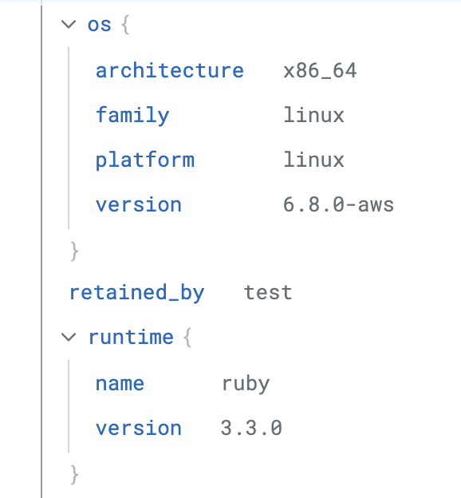

# Running Locally with CI Skippable Tests

DDTest is meant to run in CI, where Test Impact Analysis has the runtime
environment it uses to decide which tests are skippable. Local use is possible
when you want your machine to reuse the skippable tests calculated for CI.

When using Test Impact Analysis, skippable tests are scoped by runtime
environment: OS, architecture, and language version. Tests skipped in Linux CI
will not automatically be skipped on a macOS development machine because the
runtime tags differ.

Use `--runtime-tags` to override your local runtime tags with the tags from CI.

## How To Use

1. Find your CI runtime tags in Datadog.

   Open any test run from your CI in [Datadog Test Optimization](https://app.datadoghq.com/ci/test-runs). In the test details panel, look for the `os` and `runtime` sections:

   

   Note the following tags:

   - `os.architecture`, for example `x86_64`
   - `os.platform`, for example `linux`
   - `os.version`, for example `6.8.0-aws`
   - `runtime.name`, for example `ruby`
   - `runtime.version`, for example `3.3.0`

   For Python projects, `runtime.name` is `python` and `runtime.version` is the
   Python interpreter version used in CI.

2. Create the runtime tags JSON.

   ```json
   {
     "os.architecture": "x86_64",
     "os.platform": "linux",
     "os.version": "6.8.0-aws",
     "runtime.name": "ruby",
     "runtime.version": "3.3.0"
   }
   ```

3. Run DDTest with the override.

   Pass the JSON as a single-line string:

   ```bash
   ddtest run --runtime-tags '{"os.architecture":"x86_64","os.platform":"linux","os.version":"6.8.0-aws","runtime.name":"ruby","runtime.version":"3.3.0"}'
   ```

   Or use an environment variable:

   ```bash
   export DD_TEST_OPTIMIZATION_RUNNER_RUNTIME_TAGS='{"os.architecture":"x86_64","os.platform":"linux","os.version":"6.8.0-aws","runtime.name":"ruby","runtime.version":"3.3.0"}'
   ddtest run
   ```

Test Impact Analysis works on committed changes. Commit your changes before
running DDTest locally if you want accurate skippable tests.
